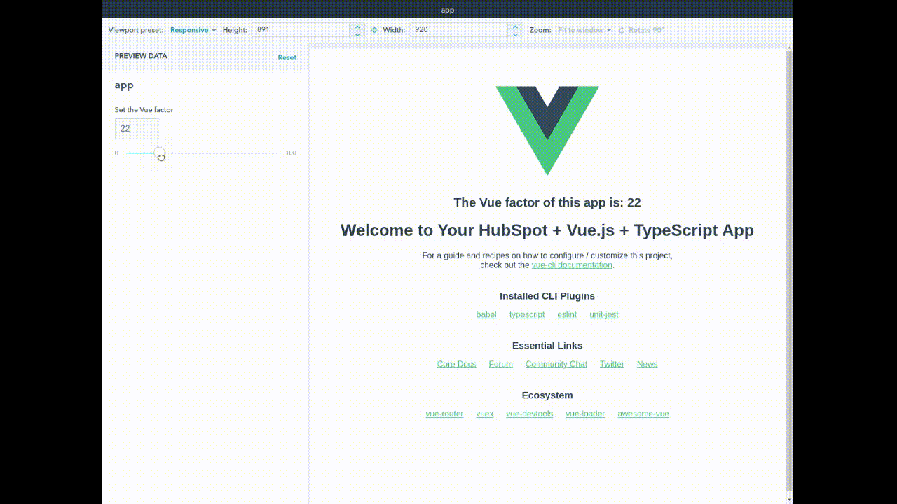

# HubSpot CMS Vue.js (2.x) Boilerplate

This boilerplate is a starting point for creating a full Vue.js 2.x app in a HubSpot module, written in TypeScript,
with full support for testing with Jest and linting with ESLint.

With CLI commands, it compiles and deploy a Vue-powered HubSpot module to your account.

Heavily inspired by [cms-react-boilerplate](https://github.com/HubSpot/cms-react-boilerplate), makes use of
[@hubspot/cms-cli](https://www.npmjs.com/package/@hubspot/cms-cli) and
[@hubspot/webpack-cms-plugins](https://www.npmjs.com/package/@hubspot/webpack-cms-plugins).

## Prerequisites

The only required dependency to use this boilerplate is `node`, that can be also used through `Docker`, 
which is the *recommended way* because you can simply run `make` commands and don't need to worry about dependencies.

* `Node 10+ / yarn`
or
* `docker 17.12.0+ / docker-compose 1.18+`
  * The project makes use of a Node container configured in the `docker-compose.yml` file. You can enter the container
   by typing `make cli` and use `yarn` commands to run the project. If you don't have Docker on your local machine you
   must have `yarn` installed and you can run yarn commands directly from your command line.

## Getting started

For more information on local development tools, see [Local Development Tooling: Getting Started](https://designers.hubspot.com/docs/tools/local-development)

### Configuration

#### Set up HubSpot CMS CLI ([`@hubspot/cms-cli`](https://www.npmjs.com/package/@hubspot/cms-cli))
- A config file named `hubspot.config.yml` will also be needed.  The config can be at the project level or higher up in the directory tree.
  * **Hint:** You can generate this file using `hs init` command from the hubspot cli.
- Be sure to set a `defaultPortal` in your `hubspot.config.yml` to which you'd like the built app files to sync.

### Install
- Run `npm install` or `yarn install` to install needed dependencies.

**Hint**: if you use `npm install` it will create a `package-lock.json` file. The project was initialized using `yarn`, that's
why you see a `yarn.lock` file. Delete `yarn.lock` if you want to use `npm`.

### Running
- Run `npm start` or `yarn start` to automatically upload your project to `defaultPortal`.
 * This will start a watcher that will upload your files every time you make a change.
- Create a page from default theme, or any drag-and-drop (`dnd_area`) enabled template in your portal, and add the `app (label: Vue app boilerplate)` module.

## Project structure

The HubSpot module configuration and template are located at `src/modules/app.module`. You can add your fields, and access
them from `App.vue` by using its props `config.moduleData`.

### package.json scripts
- `start` : Builds project with webpack, uploads to your `defaultPortal` specified in `hubspot.config.yml` and watches for changes via [`@hubspot/webpack-cms-plugins/HubSpotAutoUploadPlugin`](https://www.npmjs.com/package/@hubspot/webpack-cms-plugins).
- `build` : Clears `/dist` contents and builds project into `/dist`.
- `deploy` : Clears `/dist` contents, builds project into `/dist`, and uploads to HubSpot via [`@hubspot/cms-cli`](https://www.npmjs.com/package/@hubspot/cms-cli).
- `lint` : Lints CSS, JS, and JSON files via `eslint` ([documentation](https://eslint.org/docs/user-guide/configuring)) and checks for formatting via `prettier`([documentation](https://prettier.io/docs/en/configuration.html)) in `src`.
  - For configs, see `.prettierrc.js` and `.eslintrc.js`.
- `test` : Run unit tests with `jest` using the `vue` CLI. Tests are in `/tests` folder.

### Vue.js configuration reference
See [Configuration Reference](https://cli.vuejs.org/config/).
